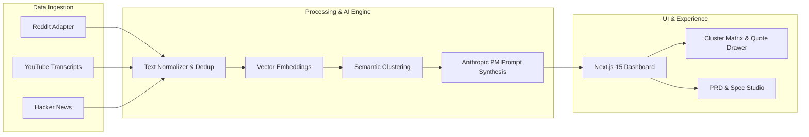

<div align="center">

# 📡 PulseRadar
### Autonomous Multi-Channel Product Research & Synthesis Studio
**Turn unstructured customer chatter across Reddit & YouTube into verified, evidence-backed product specs.**

[](./LICENSE)
[](https://www.python.org/)
[](https://nextjs.org/)
[](https://fastapi.tiangolo.com/)
[]()

[Product Vision (PRD)](./docs/PRD.md) · [System Architecture](./docs/ARCHITECTURE.md) · [UI/UX Design](./docs/DESIGN.md) · [Feature Specs](./docs/FEATURE_SPEC.md) · [Roadmap](./docs/ROADMAP.md)

---
</div>

## 💡 What is PulseRadar?

Product Managers, Founders, and Engineers waste dozens of hours every week manually skimming forum threads, Reddit rants, and YouTube reviews to understand user pain points, feature requests, and competitor shortcomings.

**PulseRadar** is an autonomous, open-source product discovery engine that:
1. **Sweeps the Web & Walled Gardens:** Ingests unvarnished discussions across **Reddit**, **YouTube video transcripts**, and tech communities.
2. **Eliminates Noise & Clusters Semantically:** Cleans bot boilerplate, vectorizes feedback, and groups discussions into categorized themes (🔴 Pain Points, 🟡 Workarounds, 🟢 Desires, 🔵 Churn Triggers).
3. **Provides 100% Grounded Evidence:** Every synthesized insight is directly attached to verbatim quotes with clickable permalinks to original discussions.
4. **Auto-Generates Production PRDs:** Synthesizes verified user signals into structured Product Requirements Documents with user stories and acceptance criteria.

---

## 🏛️ System Architecture



---

## 🚀 Key Features

*   **Multi-Channel Ingestion:** Automated search across subreddits and YouTube video transcripts with anti-bot resilience.
*   **Semantic Theme Clustering:** Unsupervised grouping of feedback items into high-level thematic clusters (e.g. *"Connection Pool Exhaustion on Serverless"*).
*   **Zero-Hallucination Grounding:** Real user quotes with author metadata, upvotes/views, and direct URLs.
*   **Interactive PRD & Spec Studio:** Instant generation of PRDs, user stories (Given-When-Then), and opportunity solution trees.
*   **Local-First & Exportable:** Self-contained architecture with SQLite storage, ready to export as an independent open-source repository.

---

## 📂 Repository Structure

```
PulseRadar/
├── backend/                      # Python FastAPI backend
│   ├── app/                      # Core application source
│   │   ├── api/v1/               # REST & SSE endpoints
│   │   ├── channels/             # Scraper adapters (Reddit, YouTube)
│   │   ├── engine/               # Text cleaning, embeddings, clustering, LLM
│   │   ├── models/               # Schemas & SQLAlchemy models
│   │   └── main.py               # FastAPI entrypoint
│   └── requirements.txt          # Backend dependencies
├── frontend/                     # Next.js 15 App Router frontend
│   ├── app/                      # Pages & layouts
│   ├── components/               # React UI & cluster components
│   └── package.json              # Frontend dependencies
├── docs/                         # Comprehensive engineering documentation
│   ├── PRD.md                    # Product Requirements Document
│   ├── ARCHITECTURE.md           # System Architecture & Technical Specifications
│   ├── DESIGN.md                 # UI/UX Specifications & Wireframes
│   ├── FEATURE_SPEC.md           # Feature Listing & Acceptance Criteria
│   └── ROADMAP.md                # Multi-stage engineering roadmap
├── docker-compose.yml            # Multi-container orchestration
├── .env.example                  # Environment configuration template
├── .gitignore                    # Clean Git exclusions
└── LICENSE                       # MIT License
```

---

## 🛠️ Quick Start (Local Setup)

### Prerequisites
*   Python 3.11+
*   Node.js 20+ & pnpm / npm
*   (Optional) Docker & Docker Compose

### 1. Clone & Configure
```bash
cp .env.example .env
```

### 2. Backend Setup
```bash
cd backend
python -m venv venv
# On Windows:
.\venv\Scripts\activate
# On Linux/macOS:
source venv/bin/activate

pip install -r requirements.txt
uvicorn app.main:app --reload --port 8000
```

### 3. Frontend Setup
```bash
cd ../frontend
npm install
npm run dev
```
Open [http://localhost:3000](http://localhost:3000) in your browser.

---

## 📑 Detailed Specifications

Explore the planning and architecture documentation:
*   📖 [Product Requirements Document (PRD)](./docs/PRD.md): Vision, user personas, functional & non-functional requirements.
*   🏛️ [System Architecture](./docs/ARCHITECTURE.md): Data pipeline, scraper adapters, vector storage, and API contracts.
*   🎨 [UI/UX Design Specifications](./docs/DESIGN.md): Visual design tokens, screen layouts, and wireframes.
*   📋 [Feature Specifications](./docs/FEATURE_SPEC.md): User stories and Gherkin acceptance criteria.
*   🗺️ [Engineering Roadmap](./docs/ROADMAP.md): 8-week phased milestone plan from MVP to production release.

---

## 📄 License
This project is open-source under the [MIT License](./LICENSE).
