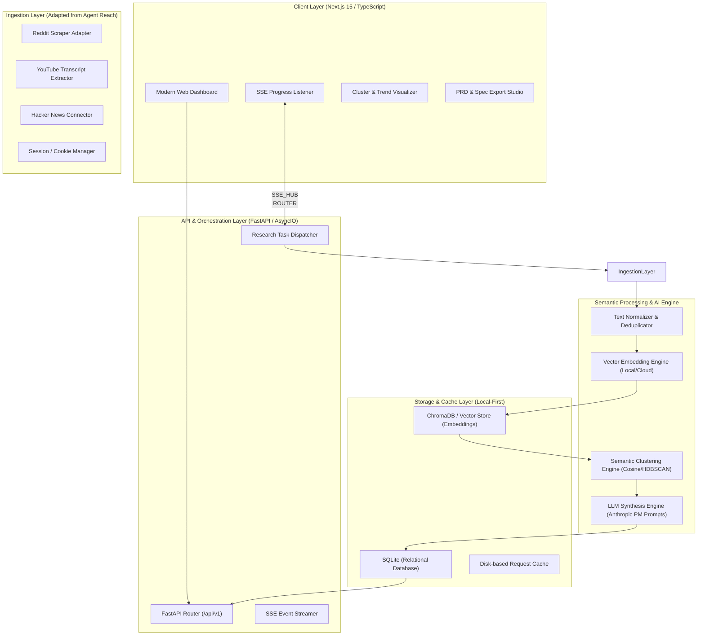
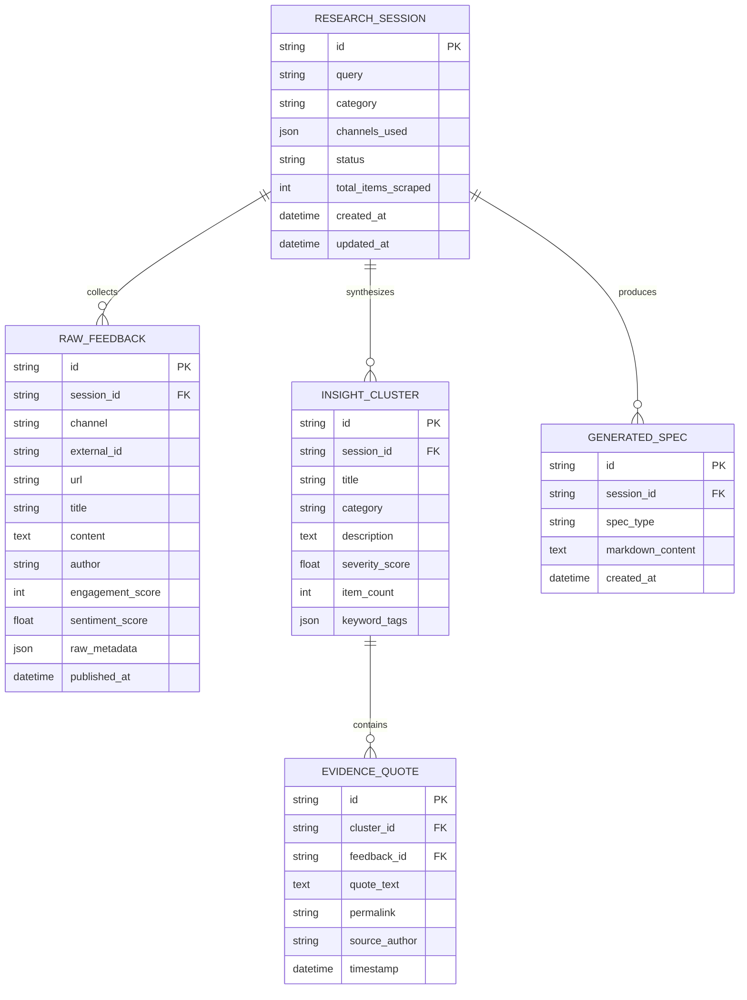

# PulseRadar — System Architecture & Technical Specifications

> **Architecture Version:** 1.0.0  
> **Status:** Implementation-Ready  
> **Stack:** Python 3.11+ (FastAPI, AsyncIO, Pydantic v2) + Next.js 15 (TypeScript, React 19, Tailwind CSS)

---

## 1. High-Level Architecture Overview

PulseRadar is designed as a **decoupled, local-first, asynchronous event-driven system**. It comprises a high-throughput Python backend that coordinates multi-channel scrapers, vector embedding pipelines, and LLM synthesis, communicating over REST and Server-Sent Events (SSE) with a modern Next.js single-page application.



---

## 2. Ingestion Pipeline & Scraper Adapters

The ingestion layer borrows and modernizes key architectural patterns from **Agent Reach** (`agent_reach/channels`):
- **Base Channel Interface:** All scrapers implement a unified asynchronous interface:
  ```python
  class BaseChannel(ABC):
      @abstractmethod
      async def search(self, query: str, limit: int = 50) -> List[RawPost]:
          """Search the channel for a given topic/keyword."""
          pass

      @abstractmethod
      async def fetch_details(self, item_id: str) -> Optional[ItemDetails]:
          """Fetch full thread/transcript details."""
          pass
  ```
- **Reddit Adapter (`channels/reddit.py`):**
  - Uses Reddit search endpoints with exponential backoff and randomized User-Agent headers.
  - Supports loading optional user cookies from local browser profiles (via `cookie_extract.py`) to bypass aggressive 403 anti-bot gates.
  - Extracts title, body, author, upvote ratio, comment tree, and permalink.
- **YouTube Adapter (`channels/youtube.py`):**
  - Searches YouTube for video reviews and product breakdowns.
  - Pulls full video transcripts via `youtube-transcript-api`.
  - Splits transcripts into timestamped, topical chunks for contextual quote attribution.
- **Deduplication & Content Hashing:**
  - Every incoming post or comment is hashed via SHA-256 over its normalized URL and core text content. Duplicate items are instantly discarded before entering the embedding pipeline.

---

## 3. Semantic Processing & AI Synthesis Engine

### 3.1 Text Normalization
- Removes spam, bot messages (e.g. `AutoModerator` comments), Markdown URLs, and noisy boilerplate.
- Filters out low-signal items (< 50 characters or low engagement metrics).

### 3.2 Embedding & Vector Storage
- Supports both **Local Embeddings** (`sentence-transformers/all-MiniLM-L6-v2` via ONNX runtime for 100% offline privacy) and **Cloud Embeddings** (`text-embedding-3-small` via OpenAI/LiteLLM).
- Embeddings are persisted in a local directory using **ChromaDB** or an in-memory vector index with SQLite fallback.

### 3.3 Semantic Clustering Algorithm
1. Compute pairwise cosine distance matrix across all embedded feedback items.
2. Group related items into cohesive thematic clusters using a density-based algorithm (Agglomerative Clustering / HDBSCAN).
3. Identify cluster centroids and label each cluster into 4 core product buckets:
   - 🔴 **Pain Point / Frustration** (bugs, performance, confusing UI)
   - 🟡 **Workaround / Hack** (how users currently solve the problem awkwardly)
   - 🟢 **Feature Request / Desire** ("I wish there was...", "Why can't it just...")
   - 🔵 **Churn / Migration Trigger** ("Switched to X because...")

### 3.4 Multi-Stage LLM Synthesis (Inspired by Knowledge Work Plugins)
The synthesis engine uses multi-phase structured prompting:
1. **Cluster Labeler:** Summarizes each semantic cluster into a punchy, actionable product headline (e.g., *"Unpredictable Cloud Costs at Scale"*).
2. **Evidence Extractor:** Extracts top 3–5 representative verbatim quotes with exact permalinks and user metadata.
3. **Executive Strategist:** Produces an overall synthesis following Anthropic's Product Management framework:
   - Executive Overview & Strategic Verdict
   - Root Causes & User Mental Models
   - Recommended Action Items & Opportunity Solution Tree
   - Pre-formatted User Stories & Acceptance Criteria

---

## 4. Database Schema (SQLite / SQLAlchemy)



---

## 5. API Interface Contract (FastAPI)

### 5.1 REST Endpoints
*   `POST /api/v1/research/start`  
    **Body:** `{ "query": "Supabase vs Firebase complaints", "channels": ["reddit", "youtube"], "max_items": 100 }`  
    **Response:** `{ "session_id": "res_89a3f2b1", "status": "QUEUED" }`

*   `GET /api/v1/research/{session_id}`  
    Returns complete session status, metrics, insight clusters, and verbatim evidence quotes.

*   `GET /api/v1/research/{session_id}/clusters`  
    Returns categorized semantic clusters (Pain Points, Workarounds, Desires).

*   `POST /api/v1/research/{session_id}/generate-prd`  
    Triggers autonomous PRD generation based on the session's verified clusters.

*   `GET /api/v1/research/{session_id}/export/{format}`  
    Exports report in `markdown`, `json`, or `csv`.

### 5.2 Server-Sent Events (SSE) Endpoint
*   `GET /api/v1/research/{session_id}/events`  
    Real-time event stream providing live UI progress updates:
    ```json
    event: progress
    data: {"stage": "scraping_reddit", "items_found": 34, "message": "Scraping r/webdev discussions..."}

    event: progress
    data: {"stage": "clustering", "message": "Clustering 82 items into semantic themes..."}

    event: completed
    data: {"session_id": "res_89a3f2b1", "clusters_found": 6}
    ```

---

## 6. Frontend Architecture (Next.js 15)

```
frontend/
├── app/
│   ├── layout.tsx                # Global Shell & Navigation
│   ├── page.tsx                  # Research Launchpad & Query Builder
│   ├── research/
│   │   └── [sessionId]/
│   │       ├── page.tsx          # Real-Time Research Dashboard
│   │       ├── clusters/page.tsx # Interactive Theme Matrix
│   │       └── prd/page.tsx      # Autonomous PRD & Spec Studio
├── components/
│   ├── query/                    # Channel selector, query input, preset suggestions
│   ├── dashboard/                # Metric cards, live event ticker, sentiment bars
│   ├── clusters/                 # Pain point cards, category filters, quote drawer
│   ├── prd/                      # Markdown editor, previewer, copy/export controls
│   └── ui/                       # Reusable design system primitives (Button, Modal, Badge)
├── lib/
│   ├── api.ts                    # Typed API client for FastAPI
│   ├── sse.ts                    # Robust EventSource reconnect handler
│   └── store.ts                  # Client-side state management (Zustand)
```

---

## 7. Directory Structure (Self-Contained for Clean Export)

```
PulseRadar/
├── backend/                      # Complete Python FastAPI backend
│   ├── app/
│   │   ├── api/v1/               # Endpoint controllers
│   │   ├── channels/             # Scraper adapters (Reddit, YouTube, HN)
│   │   ├── engine/               # Text cleaning, embeddings, clustering, LLM synthesis
│   │   ├── models/               # SQLAlchemy models & Pydantic schemas
│   │   ├── core/                 # Config, security, database initialization
│   │   └── main.py               # FastAPI entrypoint
│   ├── tests/                    # Pytest test suite
│   ├── pyproject.toml            # Modern Python dependency specification
│   ├── requirements.txt          # Pinned pip requirements
│   └── Dockerfile                # Backend container configuration
├── frontend/                     # Modern Next.js 15 App Router frontend
│   ├── app/                      # Next.js App Router pages
│   ├── components/               # React UI components
│   ├── lib/                      # Utilities & API client
│   ├── public/                   # Static assets & brand graphics
│   ├── package.json              # Node dependencies
│   ├── tsconfig.json             # TypeScript configuration
│   ├── tailwind.config.ts        # Tailwind CSS styling system
│   └── Dockerfile                # Frontend container configuration
├── docs/                         # Full architecture, design, and PRD specifications
│   ├── PRD.md
│   ├── ARCHITECTURE.md
│   ├── DESIGN.md
│   ├── FEATURE_SPEC.md
│   └── ROADMAP.md
├── docker-compose.yml            # One-click multi-container local deployment
├── .env.example                  # Environment configuration template
├── .gitignore                    # Clean git exclusion rules
├── LICENSE                       # Open-source MIT license
└── README.md                     # Root project documentation
```
