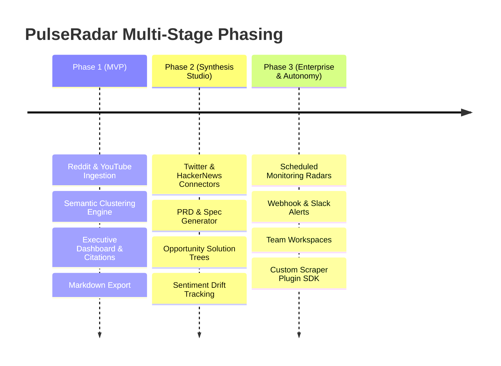

# PulseRadar — Product Requirements Document (PRD)

> **Document Version:** 1.0.0  
> **Status:** Approved / Architecture-Ready  
> **Author:** Antigravity AI & Core Team  
> **Target Release:** Q4 2026  

---

## 1. Executive Summary & Vision

### 1.1 The Problem
Product Managers, Founders, and Engineering Leads spend **15–20 hours per week** manually scouring social media (Reddit, Twitter/X, YouTube comments/reviews, Hacker News, Product Hunt) to understand customer pain points, feature requests, competitor weaknesses, and user churn causes.

Current tools fall into two broken extremes:
1. **Traditional Social Listening Tools (Brandwatch, Mention, Sprinklr):** Built for PR and marketing vanity metrics (mention counts, raw sentiment scores). They produce zero actionable product insights and cost $1,000+/month.
2. **Generic LLM Chatbots (ChatGPT, Claude):** While great at synthesis, they lack direct, authenticated, anti-bot-resilient access to real-time discussions, cannot pull video transcripts at scale, and often hallucinate user quotes.

### 1.2 The Solution
**PulseRadar** is an autonomous, open-source **Multi-Channel Product Research & Synthesis Studio**. It transforms unstructured customer discussions across walled gardens into structured, evidence-backed product intelligence.

A user inputs a product, competitor, or problem space (e.g., *"Why are teams migrating away from Datadog?"* or *"Linear vs Jira user complaints"*), and PulseRadar:
1. Orchestrates anti-bot resilient scrapers across Reddit, YouTube transcripts, Twitter/X, and tech forums.
2. Deduplicates, cleans, and semantically clusters user feedback into categorized themes (Pain Points, Feature Requests, Workarounds, Churn Triggers).
3. Synthesizes executive summaries with **verbatim, clickable evidence quotes**.
4. Automatically generates production-ready **PRDs, Opportunity Solution Trees, and Feature Specs** directly from verified user signals.

---

## 2. Target Personas

| Persona | Role & Context | Core Pain Point | PulseRadar Value |
|---|---|---|---|
| **Alex — The Product Manager** | Senior PM at B2B SaaS startup | Needs qualitative user validation before writing specs; doesn't have time to interview 50 users. | Cuts discovery time from 2 weeks to 10 minutes; generates PRD drafts with real user quotes. |
| **Priya — The Founder / Indie Hacker** | Solo builder deciding what to build next | High risk of building features nobody wants; needs to find unaddressed gaps in existing tools. | Uncovers competitor weaknesses and recurring "I wish someone built X" requests. |
| **Marcus — The Product Designer** | Lead UX/Product Designer | Needs to understand user mental models and current clumsy workarounds. | Extracts exact friction points and workflow hacks users share online. |
| **Elena — The Growth / PMM Lead** | Product Marketing Manager | Needs voice-of-customer copy for landing pages and competitive battlecards. | Delivers authentic user language, competitor objections, and sentiment trends. |

---

## 3. Core Value Proposition & Differentiators

```
+-----------------------------------------------------------------------------------+
|                              The PulseRadar Advantage                              |
+------------------------------------+----------------------------------------------+
| Traditional Tools                  | PulseRadar                                   |
+------------------------------------+----------------------------------------------+
| Brand sentiment counts (vanity)    | Actionable product clusters & root causes    |
| Text-only scraping                 | Multi-modal (Text + Video Transcripts)       |
| Hallucinated or unverifiable data  | 100% cited verbatim quotes with permalinks   |
| Disconnected from workflow         | Direct export to PRD, Markdown, Notion, Jira |
| High subscription costs ($1000+/mo)| Open-source, local-first, self-hostable      |
+------------------------------------+----------------------------------------------+
```

---

## 4. Product Scope & Multi-Stage Phasing



### 4.1 Phase 1: MVP (Minimum Viable Product) — Multi-Platform Release
*   **Target Channels (6 Platforms):**
    - **Reddit:** Multi-subreddit targeted sweep & rants with pagination.
    - **YouTube:** Deep transcript parser extracting timestamped sections across multiple review videos.
    - **Hacker News:** 100% Zero-auth Algolia API sweeping top stories and developer comments.
    - **GitHub Issues:** Open-source bug reports, discussions, and feature request tracking.
    - **Twitter / X:** Search adapter with Cookie-Editor auth token/ct0 or bearer token support.
    - **Facebook:** Community groups & public page reviews with session cookie support.
*   **Sample Size Scaling:** User-configurable depth: 40, 80, 120, or 160 signals per sweep.
*   **Platform Credentials Manager:** Built-in settings modal and `.env` support for user cookies and API tokens.
*   **Semantic Intelligence Engine:** Embeddings generated via fast local or cloud models, clustered into 4–8 adaptive semantic themes.
*   **Dashboard Experience:**
    *   Query Launcher (Target Topic / Competitor / URL).
    *   Pain Point vs. Desire vs. Workaround matrix.
    *   Verbatim quotes drawer with verified links to original posts.
    *   One-click Export to Markdown & JSON.

### 4.2 Phase 2: Synthesis Studio & PRD Generation (Weeks 4–6)
*   **Additional Channels:** Twitter/X discussions, Hacker News threads, Product Hunt comments.
*   **AI Spec Writer:** Automatically generates structured PRDs (Problem, Goals, User Stories, Acceptance Criteria) based on Anthropic’s Product Management skill templates.
*   **Visual Opportunity Solution Trees:** Visualizing root customer problems branching into potential solutions.

### 4.3 Phase 3: Continuous Monitoring & Enterprise Integrations (Weeks 7–8)
*   **Scheduled Radars:** Recurring background checks (daily/weekly) tracking sentiment drift and newly emerging complaints.
*   **Alerts & Integrations:** Instant Slack/Discord webhook notifications when negative sentiment or competitor churn discussions surge.
*   **Team Workspaces:** Multi-user projects, shared research repositories, and Notion/Linear sync.

---

## 5. Functional Requirements

### 5.1 Ingestion & Crawler Engine (FR-1)
*   **FR-1.1:** System shall support keyword-based discovery across multiple subreddits simultaneously.
*   **FR-1.2:** System shall support extracting full transcripts from relevant YouTube product review videos.
*   **FR-1.3:** System shall gracefully handle rate limits with exponential backoff and randomized user-agent rotation.
*   **FR-1.4:** System shall deduplicate content using content hashing and URL canonicalization.

### 5.2 Processing & Clustering Engine (FR-2)
*   **FR-2.1:** System shall clean unstructured text (stripping markdown artifacts, bot comments, moderator automations).
*   **FR-2.2:** System shall generate vector embeddings for each processed feedback item.
*   **FR-2.3:** System shall group items into semantic clusters with auto-generated labels (e.g., *"Pricing Structure Confusion"*, *"Slow UI Performance"*, *"Missing API Webhooks"*).
*   **FR-2.4:** System shall compute sentiment polarity (Positive, Neutral, Negative, Frustrated) and frequency weight for each cluster.

### 5.3 Insight Synthesis & Evidence Engine (FR-3)
*   **FR-3.1:** System shall generate an executive briefing summarizing top takeaways, user mental models, and urgent red flags.
*   **FR-3.2:** System shall attach at least 3 verbatim, permalinked source quotes to every identified insight cluster.
*   **FR-3.3:** System shall provide confidence scoring based on sample size and sentiment consensus.

### 5.4 Export & Artifact Studio (FR-4)
*   **FR-4.1:** System shall allow one-click export of research findings into GitHub-flavored Markdown.
*   **FR-4.2:** System shall support generating a structured PRD conforming to standard engineering spec templates.
*   **FR-4.3:** System shall support raw JSON export for programmatic consumption.

---

## 6. Non-Functional Requirements (NFRs)

*   **NFR-1 (Performance):** Research queries with up to 100 ingested items must complete end-to-end processing and synthesis in under 45 seconds.
*   **NFR-2 (Local-First & Privacy):** The application must be 100% runnable locally with SQLite and local embedding options. No user project data shall be sent to third parties other than configured LLM inference endpoints.
*   **NFR-3 (Reliability):** A scraper failure on one platform (e.g., Reddit temporary rate limit) must not abort the entire research pipeline; graceful degradation is required.
*   **NFR-4 (Portability & Exportability):** The entire codebase must exist within a self-contained root folder with decoupled backend and frontend configs, ready for independent Git initialization and deployment.

---

## 7. Success Metrics & Key Results (OKRs)

*   **KR-1 (Time to Insight):** Reduce typical qualitative discovery synthesis time from **10+ hours to < 2 minutes**.
*   **KR-2 (Grounding & Zero Hallucination):** 100% of synthesized points in the executive summary must link to real source posts.
*   **KR-3 (Community Adoption):** Reach 1,000+ GitHub stars within 60 days of open-source release; high engagement from PM and Indie Hacker communities.
