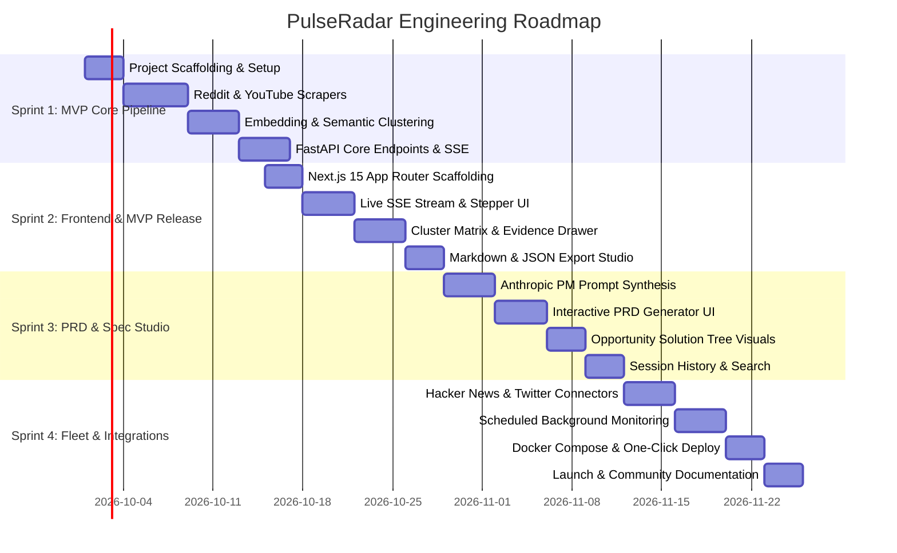

# PulseRadar — Multi-Stage Engineering Roadmap

> **Roadmap Horizon:** 8 Weeks (MVP to Production Open-Source Release)  
> **Development Cadence:** 2-Week Sprints  
> **Core Principle:** Every sprint ends in a functional, shippable milestone.

---

## Roadmap Overview Visual

---

## Detailed Sprint Milestones

### Sprint 1: MVP Core Pipeline (Weeks 1–2)
*Goal: Working Python backend capable of searching Reddit, transcribing YouTube, embedding items, and outputting clustered themes to SQLite.*
- [ ] Initialize Python backend with `FastAPI`, `Pydantic v2`, and `AsyncIO`.
- [ ] Build `RedditAdapter` utilizing search endpoints with backoff and User-Agent rotation.
- [ ] Build `YouTubeAdapter` integrating `youtube-transcript-api` with timestamp segmentation.
- [ ] Implement text cleaner (boilerplate stripper, noise filter, deduplication via SHA-256).
- [ ] Implement vector embedding service (local `sentence-transformers` + cloud fallback).
- [ ] Implement clustering algorithm (cosine distance + centroid labeling).
- [ ] Build SQLite persistence layer with SQLAlchemy models.
- [ ] Expose REST endpoints + SSE event stream (`/api/v1/research/start`, `/events`).

### Sprint 2: Frontend & MVP Shipped (Weeks 3–4)
*Goal: Complete, usable web application where a user can enter a query, watch the live ingestion, explore clusters, and export markdown.*
- [ ] Scaffold Next.js 15 App Router frontend with TypeScript and Tailwind CSS.
- [ ] Build Query Launchpad with presets and channel toggles.
- [ ] Build real-time SSE listener and animated progress stepper.
- [ ] Build Cluster Matrix component displaying Pain Points, Workarounds, and Desires.
- [ ] Build Slide-Over Evidence Drawer displaying verbatim quotes with clickable permalinks.
- [ ] Build Export Modal supporting one-click Markdown and JSON downloads.
- [ ] End-to-end integration tests between Next.js and FastAPI.

### Sprint 3: Autonomous PRD & Spec Studio (Weeks 5–6)
*Goal: Transform verified clusters into production-ready product specs with zero manual typing.*
- [ ] Integrate prompt engineering frameworks from Anthropic Product Management skills.
- [ ] Implement `PRDGenerator` generating Problem Statements, Goals, User Stories, and Acceptance Criteria.
- [ ] Build PRD Studio UI with split markdown preview, live editing, and section regeneration.
- [ ] Add Opportunity Solution Tree interactive visualization.
- [ ] Add local session history drawer to resume or re-run past research queries.

### Sprint 4: Advanced Connectors & Production Release (Weeks 7–8)
*Goal: Community-ready open-source package with containerization, scheduled alerts, and multiple channels.*
- [ ] Implement Hacker News Algolia API adapter.
- [ ] Implement Twitter/X discussion scraper with anti-bot handling.
- [ ] Add scheduled background monitoring (daily/weekly automated query sweeps).
- [ ] Add webhook integration (Slack/Discord alerts on sentiment shifts).
- [ ] Create multi-container `docker-compose.yml` for zero-friction local deployment.
- [ ] Write contributor guides, video walkthrough, and publish initial v1.0.0 release.
